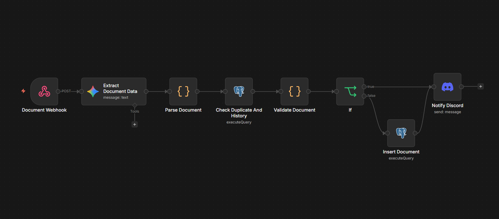

# Sistema de Ingestión Inteligente de Documentos

Pipeline de datos construido en n8n que automatiza la ingestión, extracción
y validación de documentos comerciales (facturas, boletas, notas de crédito)
a partir de PDFs, emails y CSVs, usando un LLM para extracción estructurada
y Postgres como almacenamiento final.

## Flujo

Webhook → Extracción con LLM (Google Gemini) → Parseo y normalización →
Validación de negocio (duplicados, anomalías, integridad de datos) →
Postgres → Notificación en Discord



## Características

- **Extracción estructurada con LLM**: usa Gemini con salida en JSON para
  extraer campos de documentos no estructurados (texto de PDF/email) según
  un JSON Schema definido (tipo de documento, proveedor, cliente, items,
  montos, impuestos, etc.)
- **Detección de duplicados**: hash MD5 de `numero_documento + proveedor_ruc`
  para identificar si un documento ya fue ingresado previamente
- **Detección de anomalías**: compara el monto total contra el promedio
  histórico del mismo proveedor, marcando desviaciones significativas
  (>50%) para revisión manual
- **Validación de integridad**: documentos con campos críticos faltantes
  (número de documento, RUC del proveedor, monto, fecha de emisión) se
  descartan del insert y generan una alerta, sin ensuciar la base de datos
- **Estados de validación**: cada documento queda clasificado como `ok`,
  `revision` o `error`, permitiendo auditoría posterior
- **Notificaciones en tiempo real**: alertas en Discord con mensaje
  dinámico según el resultado de la validación

## Stack

- **n8n** (orquestación del workflow, corriendo en Docker)
- **Google Gemini** (extracción de datos vía LLM con salida estructurada)
- **PostgreSQL / Supabase** (persistencia, incluye columna `raw_extraction`
  para auditoría del JSON crudo devuelto por el LLM)
- **Discord** (notificaciones)

## Instalación

### Requisitos previos
- Docker Desktop instalado
- Cuenta de Supabase (o cualquier Postgres accesible)
- API key de Google Gemini
- Bot de Discord con webhook configurado

### Pasos

1. Clona el repositorio:
```bash
git clone https://github.com/tu-usuario/sistema-ingestion-documentos.git
cd sistema-ingestion-documentos
```

2. Crea tu archivo `.env` a partir del ejemplo:
```bash
cp .env.example .env
```
Y completa tus propios valores (usuario/password de la base de datos interna de n8n).

3. Levanta los contenedores:
```bash
docker compose up -d
```

4. Abre n8n en `http://localhost:5678`, configura tus credenciales
   (Postgres/Supabase, Gemini, Discord) desde la sección **Credentials**.

5. Importa el workflow: en n8n, ve a **Workflows → Import from File** y
   selecciona `workflows/pipeline-ingestion.json`.

6. Crea la tabla en tu base de datos ejecutando `sql/schema.sql`.

## Estado actual

- ✅ Fase 0 — Diseño (JSON Schema + esquema de base de datos)
- ✅ Fase 1 — Esqueleto del pipeline (webhook → insert → notificación)
- ✅ Fase 2 — Extracción real con LLM, probado end-to-end
- ✅ Fase 3 — Validación de negocio (duplicados, anomalías, integridad)